<!-- Terminal typing banner -->

  

---

<table>
<tr>
<td width="50%" align="center" valign="top">

<!-- LANGUAGES -->

<!-- MUSIC -->

<!-- RSS -->

</td>
<td width="50%" align="center" valign="top">

<!-- WAKATIME -->

<!-- STOCKS -->

</td>
</tr>
</table>
